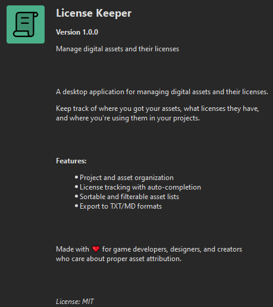

# License Keeper

**License Keeper** is a desktop application for managing digital assets and their licenses. Keep track of where you got your assets, what licenses they have, and where you're using them in your projects.


## Screenshots


*Main interface showing project management, asset tracking, and sortable/filterable asset lists*


*About dialog with application information*

## Features

**Project Management**
- Organize assets by project
- Customizable field configuration per project
- Track project type, status, and usage

**Asset Tracking**
- Record asset name, type, author, and source
- Download date tracking
- Proof file/folder attachment for license verification

**License Management**
- Support for common licenses (CC0, CC BY, MIT, GPL, etc.)
- Auto-fill legal permissions based on license type
- Track commercial use, modifications, and attribution requirements
- Custom license support

**Smart Features**
- **Sortable columns** - Click headers to sort assets
- **Type filtering** - Filter assets by type
- **Auto-complete** - Legal fields auto-fill based on license
- **Export** - Generate TXT/MD reports of your assets

## Installation

### Requirements
- Python 3.8 or higher
- PySide6

### Setup

1. Clone or download this repository:
```bash
git clone https://github.com/yourusername/license-keeper.git
cd license-keeper
```

2. Install dependencies:
```bash
pip install -r requirements.txt
```

3. Run the application:
```bash
python main.py
```

## Usage

### Creating a Project

1. Click **"New project"**
2. Fill in project details (name, type, status)
3. Configure which fields you want to use for assets in this project
4. Click **"Save"**

### Adding Assets

1. Select a project from the list
2. Click **"New asset"**
3. Fill in asset information:
   - Name/description
   - Asset type (Image, Music, Font, etc.)
   - Author/source
   - Source URL
   - License type
4. Legal fields will auto-fill based on the license
5. Click **"Save asset changes"**

### Organizing Assets

- **Sort**: Click on column headers (Name, Type, Author, License) to sort
- **Filter**: Use the "Filter by type" dropdown to show only specific asset types
- **Search**: Assets are listed alphabetically within each project

### Exporting

1. Select a project
2. Click **"Export TXT/MD"**
3. Choose format (Markdown or Plain Text)
4. Save the report with all asset details and licenses

## Database

License Keeper uses SQLite to store all data locally in `data/licenses.db`. Your data is stored entirely on your computer.

## Asset Types

Built-in asset types:
- Image / Sprite / Tileset
- Music
- SFX
- Font
- Code
- 3D model

You can also create custom asset types as needed.

## Supported Licenses

Auto-completion is available for:
- Creative Commons (CC0, CC BY, CC BY-SA, CC BY-NC, CC BY-NC-SA)
- Open Source (MIT, GPL, LGPL)
- Public Domain
- Proprietary
- Custom licenses

## Tips

**Use Proof Files**: Attach screenshots, license files, or README files as proof of licenses. This helps you verify licenses later.

**Configure Per Project**: Different projects may need different tracking. Use the project configuration to show/hide legal details, usage, and notes fields.

**Export Regularly**: Generate reports before releases to ensure all attribution requirements are met.

## Author

Created by Arkaitz Redruello (redarkun)

## License

This project is licensed under the MIT License - see the LICENSE file for details.

## Contributing

Contributions are welcome! Please feel free to submit a Pull Request.

## Support

If you encounter any issues or have suggestions, please open an issue on GitHub.

---

Made for game developers, designers, and creators who care about proper asset attribution.

## Credits

**Application Icon**: License icon from [SVG Repo](https://www.svgrepo.com/svg/508106/license) by scarlab (MIT License)
